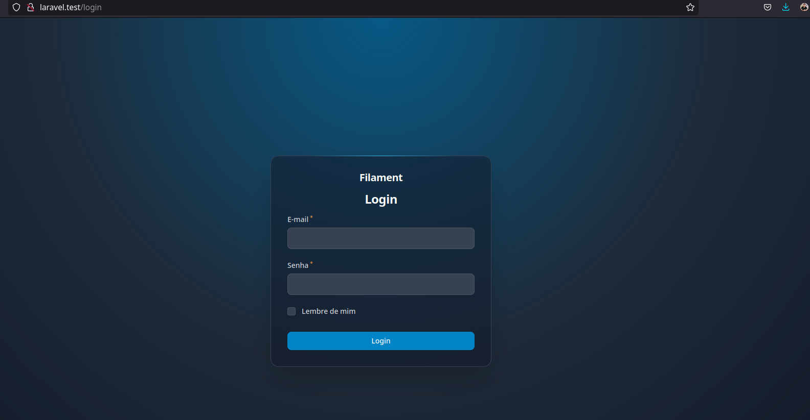

# Painel Admin Filament - Laravel





## Optica2 - this a partial clone of a real project.

This is for learning purposes only.

Made with Laravel, Filament Admin and Spatie / Permission. I am very grateful to the creators of these great frameworks and packages.

## Learning Laravel

Laravel has the most extensive and thorough [documentation](https://laravel.com/docs) and video tutorial library of all modern web application frameworks, making it a breeze to get started with the framework.

If you don't feel like reading, [Laracasts](https://laracasts.com) can help. Laracasts contains over 1500 video tutorials on a range of topics including Laravel, modern PHP, unit testing, and JavaScript. Boost your skills by digging into our comprehensive video library.

## Fillament Admin

Filament is a collection of tools for rapidly building beautiful TALL stack interfaces, designed for humans.

### Admin Panel • [Documentation](https://filamentadmin.com/docs/admin) • [Demo](https://demo.filamentadmin.com)

## Laravel Permission by Spatie

This package allows you to manage user permissions and roles in a database.

See the [DOCUMENTATION](https://docs.spatie.be/laravel-permission/) for detailed installation and usage instructions.

## Filament Shield

The easiest and most intuitive way to add access management to your Filament Resource Models (more coming soon 😎)

Access the [Repository](https://github.com/bezhanSalleh/filament-shield) by [Bezhan Salleh](https://github.com/bezhanSalleh), to check all the documentation.

## Filament Spatie Laravel Backup

This package provides a Filament page that you can create backup of your application. You'll find installation instructions and full documentation on spatie/laravel-backup.

Access the [Repository](https://github.com/shuvroroy/filament-spatie-laravel-backup) by [Shuvro Roy](https://github.com/shuvroroy), to check all the documentation.

## Filament Breezy

The missing toolkit from Filament Admin with Breeze-like functionality. Includes login, registration, password reset, password confirmation, email verification, and a my profile page. All using the TALL-stack, all very Filament-y.

Access the [Repository](https://github.com/jeffgreco13/filament-breezy) by [Jeff Greco](https://github.com/jeffgreco13), to check all the documentation.

## Installation Guide: Docker and Laravel Sail

This guide walks you through the process of setting up a Laravel application using Docker and Laravel Sail. Please ensure you have Docker installed before proceeding. Laravel Sail is a lightweight command-line interface for manipulating Laravel's default Docker environment.

1. **Clone the repository and navigate into the directory:**

   Use the following commands to clone the repository and navigate into the directory:

    ```shell
    git clone https://github.com/felipe-balloni/optica2.git optica2 && cd optica2
    ```

2. **Create a Docker container:**

   Run the following command to create a Docker container using Laravel's default PHP 8.1 and Composer settings:

    ```shell
    docker run --rm \
    -u "$(id -u):$(id -g)" \
    -v "$(pwd):/var/www/html" \
    -w /var/www/html \
    laravelsail/php81-composer:latest \
    composer install --ignore-platform-reqs
    ```

3. **Configure Environment Variables:**

   Copy the '.env.example' file to '.env' and modify the variable settings as needed. Make sure to appropriately configure your database settings (`DB_CONNECTION, DB_HOST, DB_PORT, DB_DATABASE, DB_USERNAME, DB_PASSWORD`) and the application settings (`APP_URL, APP_PORT, FORWARD_DB_PORT`):

    ```shell
    cp .env.example .env
    ```

4. **Generate an application key:**

   Before initializing the Laravel Sail environment, generate an application key using the following command:

    ```shell
    ./vendor/bin/sail artisan key:generate
    ```

5. **Install JavaScript dependencies:**

   Use npm or yarn to install JavaScript dependencies:

    ```shell
    ./vendor/bin/sail npm install
    ```

   or

    ```shell
    ./vendor/bin/sail yarn install
    ```

6. **Run the first build process for JavaScript assets:**

   In order to compile your assets for the first time, you have to run:

    ```shell
    ./vendor/bin/sail npm run dev
    ```

   or

    ```shell
    ./vendor/bin/sail yarn run dev
    ```

7. **Start Laravel Sail:**

   Use the following command to start Laravel Sail. The '-d' flag runs the containers in the background:

    ```shell
    ./vendor/bin/sail up -d
    ```

8. **Run database migrations and seed data:**

   Use this command to perform database migrations and seed data:

    ```shell
    ./vendor/bin/sail artisan migrate --seed && ./vendor/bin/sail artisan shield:generate
    ```

#### Default User Credentials

The seeder creates the following users:

Super Administrator
- **Username:** super.admin@test.com
- **Password:** password

Administrator
- **Username:** admin@test.com
- **Password:** password

Additional Users
- **Username:** user1@test.com
- **Password:** password
- **Username:** user2@test.com (_inactive_)
- **Password:** password

Note that these users and administrators initially have no permissions. You need to log in as the Super Administrator to configure their permissions.

You can now access the webpage at http://localhost:8000 and sign in using the above credentials.

#### Note:
The application is set to pt_BR language and America/Sao_Paulo time zone by default. If necessary, remember to change these in your config/app.php configuration file.
